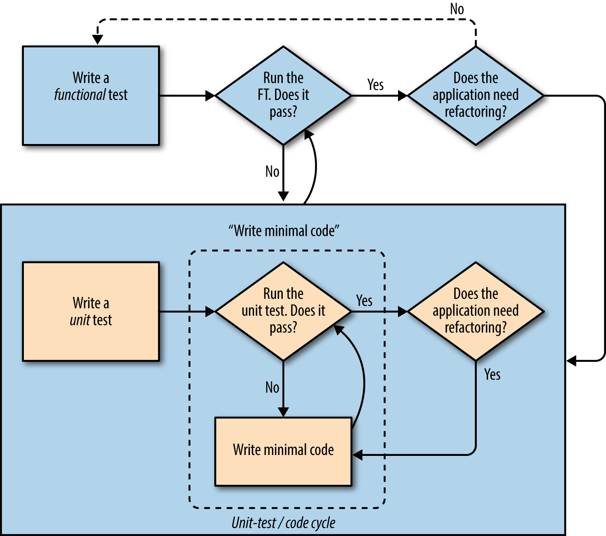

==================================================
Notes on Test Driven Development (TDD) with Python
==================================================

TDD emphasises incrementally building application through testing.

Functional testing is testing how the application functions from the user's
point of view. We do this through the use of Selenium.

Functional test == Accceptance test == End-to-End test == Black box test

On the other side there are unit tests which test the application from the
inside i.e. the programmer's point of view.

Functional tests help build apps with the right functionality and 
guarantees you will never accidentally break it. Unit tests help in writing
code that's clean and bug free.

Having tests enables us to refactor code with peace of mind.

=============
TDD Work Flow
=============

1. Write functional tests / user story
2. Design code to resolve user story and write one or more
   unit tests to define how the code should behave
3. Write the *smallest amount of application code* to pass
   the unit test. Iterate until enough progress is made
   on the functional test.
4. Rerun functional tests and see if they pass

The Unit Test Process

1. Write a test
2. Run test and see if fail
3. Write minimal code to progress
4. Repeat steps 2-3 until test passes
5. If the code needs refactoring, iterate step 2 to 4. If not then
   start back at step 1.

The Double Loop TTD Process

Remember: Functional tests are the *ultimate* judge of whether your
application works or not. The unit tets are a tool to help you 
along the way.

======
Django
======

Django generally follows the MVC pattern however its views are more like
controllers while their templates are more like views.

Work Flow
---------
User through the browser provides inputs (GET, POST) which forms a `HTTP
Request` which the Django resolves through the projects urls/app urls and
directs to a Django view which then process the request, access the database
required and returns a HttpResponse which may include a template (HTML).

============
Unit Testing
============

**Rule of Unit Testing**: Don't test contants, unit tests should 
test *logic, *flow control* and *configuration*

Python standard libraries include a ``unittest`` module. To use the 
unittest module, create a class that subclasses unittest

::

    class MyTest(unittest.TestCase):
        def setUp(self):
            # set up for each test

        def tearDown(self):
            # clean up code for each test

        def test_dummy(self):
            # some test

    if __name__ == '__main__':
        unittest.main()

Django has it's own unittest module which extends the python standard
library unittest. ``django.test``

=========
Debugging
=========

There are a few options when debugging they include:

    * print statements
    * improve error messages
    * manually visit the site yourself
    * `time.sleep` to pause test during execution 

========
Security
========

When using POST requests you need to include a `CSRF token` so that the
Django knows the request comes from the original site and prevents
CSRF attacks. The CSRF token is auto generated by Django.

Django will subtitute the ```` with an 
``<input type="hidden">`` during rendering.

========
Selenium
========

The send_keys method allows the code to mimic keyboard inputs. For special
charaters you could use:

::
    from selenium.webdriver.common.keys import Keys

    inputbox.send_keys(Keys.ENTER)

Other selenium methods:

    * `find_element_by_tag_name`
    * `find_element_by_id`
    * `find_elements_by_tag_name`

===============
Data Validation
===============

In a web app you can validate on the:

    * Client side (JavaScript or HTML5 properties)
    * Server side (`Model` level or higher up at the `Forms` level)

Validation at the server side is *safer* because someone can always bypass the client side and `Model` level is safer as you can sometimes forget which form you use to validate input but all input must go through the database and hence `Model`.
